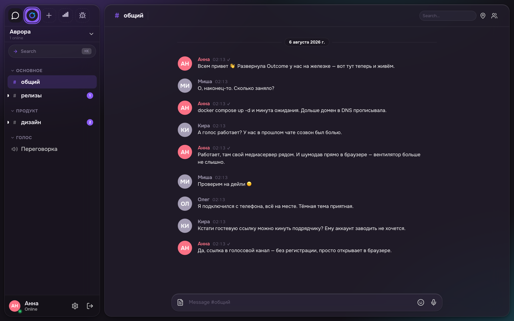
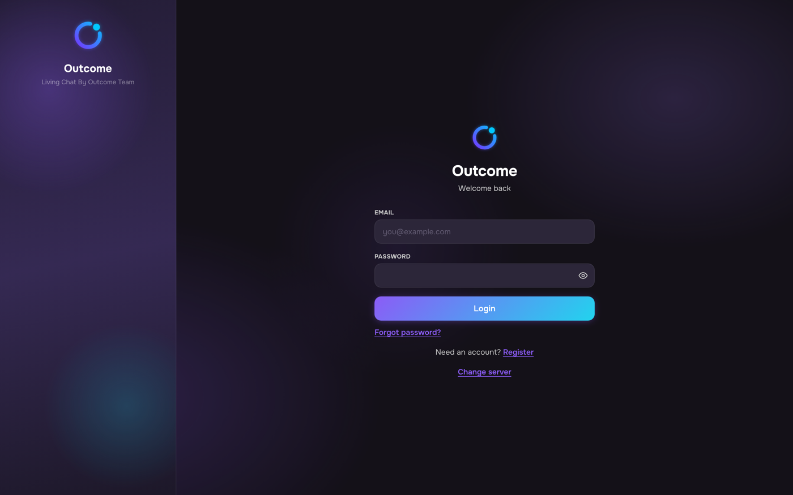
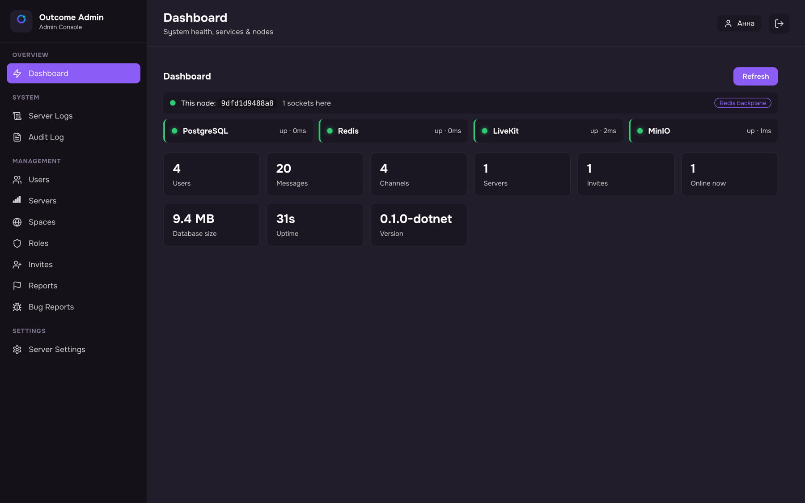
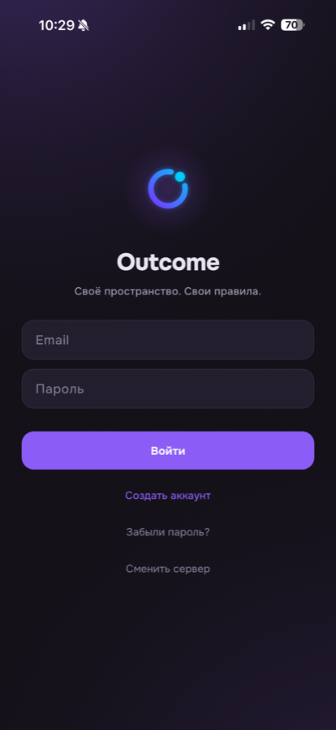
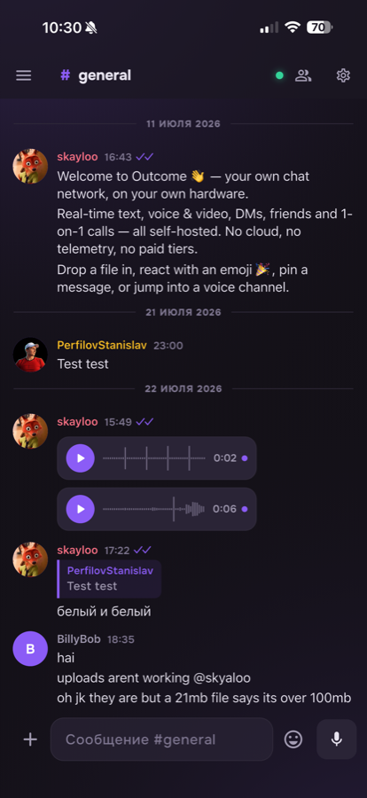
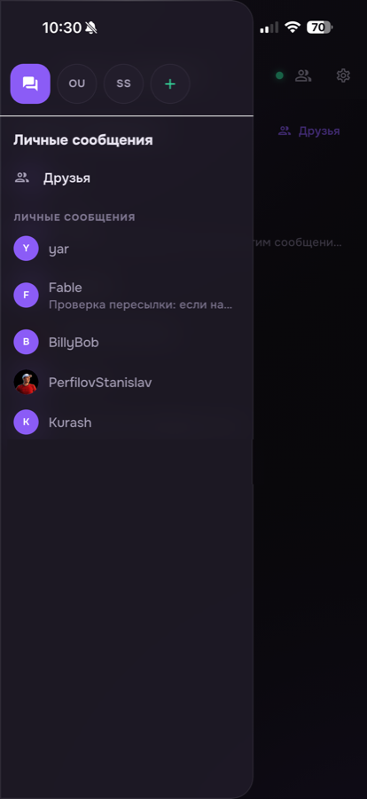
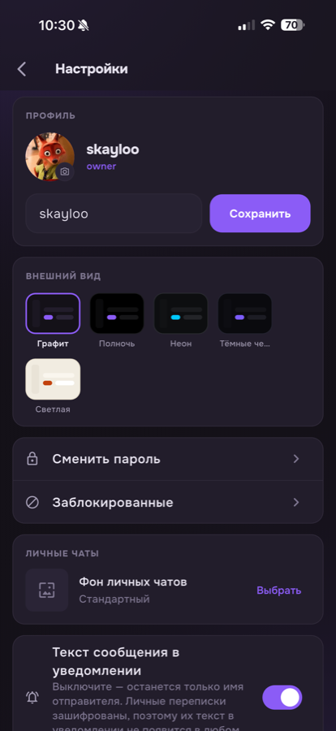

# Outcome

*Living chat — your server, your rules.*

> **Early Alpha.**
> Outcome is under active development and not yet production-hardened. Don't use it for sensitive communications yet.

**Outcome** is a self-hosted Discord-style chat platform. Real-time messaging, direct messages, friends, 1-on-1 calls, voice/video channels, roles & permissions, and a full web admin console — all running on **your** hardware, with **no cloud dependency, no telemetry, and no paid tiers**. Ever.

It runs entirely in the **browser** — nothing to install for your users. One `docker compose up` and you have your own chat network.

> This repository is **private**: the source is proprietary (see [LICENSE](LICENSE)). Outcome ships to the world as prebuilt Docker images (`skayloo/outcome-server`, `skayloo/outcome-frontend`) — free to self-host via the public deployment kit at [github.com/Skayloo/Outcome](https://github.com/Skayloo/Outcome). Release flow: `./deploy/release.sh <version>` on an amd64 host after `docker login`.

<p align="center">
  
</p>

<p align="center">
  
  
</p>
<p align="center">
  
  
  
  
</p>

## Features

### Chat
- Real-time text messaging over WebSocket
- Edit, delete (soft-delete), and **reply** to messages — replies to a deleted message/user render a *"Deleted message"* placeholder
- Emoji reactions with per-message counts and an emoji picker
- Typing indicators and read/unread markers
- Full-text message search
- Pinned messages per channel
- Clickable link detection and inline image-URL previews
- Drag-and-drop and paste file uploads (per-file progress)

### Direct Messages, Friends & Calls
- **User search** by username or email
- **Friends** — send / accept / decline requests, with live notifications
- One-on-one **direct messages** with any user
- **End-to-end encrypted DMs** (NaCl box, Curve25519) — the server stores only ciphertext; an encrypted key backup (unlocked by your password or a backup passphrase) restores history on a new device
- **Phone-style 1-on-1 calls** — ring the other person, they get an incoming-call screen with a ringtone (accept / decline), then both drop into a private LiveKit voice room; calls to someone offline are parked and delivered the moment they open the app
- Either DM participant can delete any message in the conversation — deletion physically erases the content (Telegram-style)

### Voice & Video
- Voice & video channels powered by the **LiveKit** SFU
- Mute, deafen, camera, and screen-share controls
- Push-to-talk via a global hotkey (works while unfocused)
- Per-user volume control (right-click a participant)
- Voice-activity detection with speaking indicators
- Enhanced noise suppression
- Join/leave chimes — including when **other** people enter or leave your channel
- Adjustable input sensitivity

### Servers, Channels & Members
- Multiple **servers** (tenants) in one deployment, with a Discord-style server rail
- Discord-style server header menu: invite people, server settings, create channel, delete server
- **Invite-only** membership — only invited users become members
- Text & voice channels organized by collapsible categories
- Create / edit / delete channels (soft-delete)
- Server **soft-delete** (kicks members first, fully recoverable)
- **Per-server permissions** — whoever creates a server becomes its admin
- Member list with online/offline presence, avatars, and status
- Quick channel switcher (Ctrl+K) and global keybinds

### Users & Permissions
- Open **or invite-only** registration — a runtime admin switch; invite codes optionally drop the new account straight into a server
- **SSO sign-in with Google and Yandex** — optional per provider: supply OAuth keys and the button appears, leave them empty and it doesn't
- **Avatars** — upload and change your profile picture
- Claim-based **role permissions** with custom roles and per-channel overrides
- User status (online / idle / dnd / offline)
- Self-service **account deletion** (soft-delete: your messages are kept as *"Deleted message"* placeholders so replies still make sense)
- Two-factor authentication — TOTP authenticator apps **and** email one-time codes

### Security & Abuse Protection
- Argon2id password hashing (OWASP parameters, transparent rehash on login)
- Per-IP **and** instance-wide rate limits on register/login — a lone abuser hits the first, a botnet hits the second
- Concurrent WebSocket connections capped per IP
- Real client IPs behind reverse proxies via a **trusted-proxy allowlist** (`OUTCOME_TrustedProxies`) — rate limits, bans, and the audit log see the actual visitor, and the header can't be forged from outside
- OAuth flows carry HMAC-signed anti-CSRF state, so callbacks survive load-balancing across replicas

### Administration
- Web admin console with:
  - **Dashboard / diagnostics** — users, messages, channels, servers, online count, DB size, uptime, version
  - **User management** — ban / unban / kick / role assignment
  - **Channel management** — create / edit / delete
  - **Roles & invites** management
  - **Server settings** — including live **registration switches** (open/closed, invite-only)
  - **Audit log** — every admin action, with the actor's name
  - **Live server logs** — real-time stream over SSE with level filter, search, pause/clear
- Interactive **OpenAPI reference** (Scalar) served by the backend

### Look & Feel
- Internationalized UI — **English & Russian** out of the box
- Themes — Dark, Neon Glow, Midnight, and Light — plus a custom accent color
- Accessibility options — reduced motion, high contrast, larger fonts

## Quick Start (Docker)

The whole stack — backend, web frontend, PostgreSQL, object storage, and LiveKit — runs from one Compose file.

```bash
git clone https://github.com/skayloo/Outcome.git
cd Outcome
docker compose up -d --build
```

Then open **http://localhost:8080** in your browser. On first run you'll be walked through creating the **Owner** account; after that, generate an invite code (admin console → Invites) and share it so friends can register.

> **Note:** microphone, camera and calls require a **secure context** — i.e. `http://localhost` or **HTTPS**. Over a plain `http://<lan-ip>` address the browser blocks `getUserMedia`. For LAN/internet access, front the stack with TLS (see *Reverse proxy & TLS* below).

### Ports

| Port | Service | Notes |
| ---- | ------- | ----- |
| `8080` | Web frontend (nginx) | What users open; reverse-proxies `/api` and `/livekit` to the backend |
| `5000` | .NET backend | Exposed for direct REST/OpenAPI access & debugging |
| `9000` / `9001` | MinIO (S3 storage / console) | Uploaded files |
| `7880` / `7881` | LiveKit signaling (WS / TCP fallback) | Voice/video |
| `7882/udp` | LiveKit WebRTC media | Single **muxed** media port shared by all participants — must be reachable directly |

## Architecture

Outcome is a **modular monolith** backend plus a **web SPA**, wired together by nginx so everything is same-origin (no CORS).

```text
                Browser (React + TypeScript SPA)
                        │  HTTPS / WSS
                        ▼
        ┌───────────────────────────────┐
        │   nginx  ( :8080 )             │   serves the SPA,
        │   /api → backend               │   reverse-proxies API,
        │   /livekit → backend           │   WS and LiveKit signaling
        └───────────────┬───────────────┘
                        ▼
        ┌───────────────────────────────┐        ┌──────────────┐
        │  .NET 10 backend ( :5000 )     │◀──────▶│  PostgreSQL  │
        │  REST · WebSocket · SSE        │        └──────────────┘
        │  MediatR CQRS · EF Core        │        ┌──────────────┐
        │  OpenAPI/Scalar · SPA fallback │◀──────▶│  MinIO (S3)  │
        └───────────────┬───────────────┘        └──────────────┘
                        │  LiveKit tokens / room mgmt
                        ▼
                ┌──────────────┐
                │  LiveKit SFU │   voice & video (WebRTC)
                └──────────────┘
```

- **WebSocket** — chat, typing, presence, reactions, voice signaling, friend & call events
- **REST API** — message history, uploads, channels, servers, friends, admin
- **SSE** — live admin log streaming
- **LiveKit** — voice/video via an SFU; a 1-on-1 call reuses the two users' DM channel as the room
- **Redis** (optional) — set `OUTCOME_Redis__Url` and any number of API replicas behave like one server: WS fan-out, reconnect replay, 2FA challenges, and offline-call parking all ride the backplane

## Project Structure

```text
Outcome/
├── ServerDotnet/            # .NET 10 backend (modular monolith)
│   ├── Outcome.Api/         #   Host: minimal APIs, WebSocket, middleware, OpenAPI
│   ├── Shared/              #   Abstractions, Core, EF DbContext + migrations
│   ├── Identity/            #   Users, auth, roles, invites, friends, admin
│   └── Chat/                #   Channels, messages, DMs, voice
├── frontend/                # React + TypeScript web SPA (Vite)
│   └── src/
│       ├── lib/             #   Core services (api, ws, dispatcher, call, voice…)
│       ├── stores/          #   Reactive stores (auth, channels, messages, voice, friends, call…)
│       ├── components/      #   UI components
│       └── styles/          #   CSS + themes
├── docs/                    # Documentation
├── deploy/                  # Production deployments: compose (+Caddy TLS), swarm, k8s, helm
├── docker-compose.yml       # Full stack: backend + frontend + Postgres + MinIO + LiveKit
└── docker-compose.scale.yml # Overlay: 3 API replicas behind nginx, coordinated via Redis
```

## Development

Run backend commands from `ServerDotnet/`, frontend commands from `frontend/`.

```bash
# Backend (.NET 10)
cd ServerDotnet
dotnet build
dotnet test

# Frontend (Node 20)
cd frontend
npm install
npm run dev          # Vite dev server
npm run build        # production build (tsc + vite)
npm run typecheck
npm run lint
```

Or just rebuild a single service in Docker while iterating:

```bash
docker compose build server    # or: frontend
docker compose up -d server
```

## Reverse Proxy & TLS

For LAN/internet access you'll want real TLS (which also unlocks microphone/camera in the browser). [Caddy](https://caddyserver.com/) with automatic Let's Encrypt certificates is the easiest option — put it in front of the frontend (`:8080`); the production compose stack in [deploy/compose](deploy/compose) already wires this up. WebSocket upgrades and SSE pass through transparently.

One caveat is inherent to WebRTC (not Caddy): LiveKit **media** travels over UDP (`7882`, one muxed port) plus a TCP `7881` fallback, directly between the client and LiveKit — **not** through the HTTP proxy. Expose those ports on the host and set LiveKit's external IP so voice/video works from outside the LAN.

## Production & Scaling

Ready-made deployments live in [deploy/](deploy/): a hardened single-host **Compose** stack (Caddy TLS, secrets via `.env`), a **Swarm** stack, and **Kubernetes** manifests + a Helm chart. The API is stateless once `OUTCOME_Redis__Url` is set — scale replicas freely (`docker-compose.scale.yml` runs three) — while LiveKit stays **one node per public IP** (WebRTC media can't share a NAT). See [deploy/compose/README.md](deploy/compose/README.md) for real-client-IP / Cloudflare / DDoS notes.

## Tech Stack

| Component | Technology |
| --------- | ---------- |
| Backend | .NET 10, ASP.NET Core minimal APIs, MediatR (CQRS) |
| Database | PostgreSQL (EF Core + Npgsql, EF Core migrations) |
| Object storage | MinIO (S3-compatible) |
| Frontend | React + TypeScript (Vite), vanilla reactive stores |
| Voice / Video | LiveKit SFU (WebRTC) |
| API docs | OpenAPI + Scalar |
| Deployment | Docker Compose, nginx, optional Caddy for TLS |

## License

Proprietary — see [LICENSE](LICENSE). The application is distributed as prebuilt Docker images, free to pull and self-host for any personal or commercial use; the deployment kit ([Skayloo/Outcome](https://github.com/Skayloo/Outcome)) is MIT. No paid tiers.
